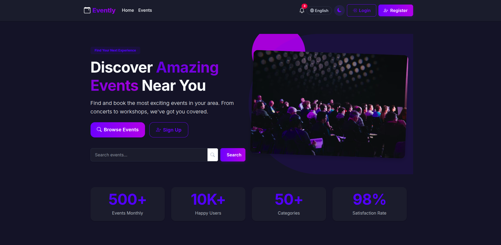

# Evently - Event Booking System

[🌐 **Live Demo on Azure**](https://evently-booking.azurewebsites.net)

A full-stack event booking system built with Django, featuring a modern UI with HTMX and responsive design.


## 🌟 Features

### Public Features
- Browse and search events
- Book events with instant confirmation
- User authentication (login/register)
- Responsive design for all devices
- Multi-language support (English + Arabic)

### Admin Features
- Custom admin dashboard
- CRUD operations for events
- Booking management
- User management
- Real-time updates with HTMX

## 🛠 Tech Stack

- **Backend**: Django 5.0 + Django REST Framework
- **Frontend**: Django Templates + HTMX
- **Database**: SQLite (development) / PostgreSQL (production on Azure)
- **Deployment**: Docker, Azure Web App for Containers
- **CI/CD**: GitHub Actions (auto-deploys on push to main)
- **Authentication**: Django Auth System
- **API Documentation**: Swagger
- **Internationalization**: django-modeltranslation

## 🚀 Quick Start

### Local Development

1. **Clone the repository:**
   ```bash
   git clone https://github.com/1abdelhalim/Evently.git
   cd Evently
   ```
2. **Create and activate a virtual environment:**
   ```bash
   python -m venv venv
   source venv/bin/activate  # Linux/Mac
   # or
   .\venv\Scripts\activate  # Windows
   ```
3. **Install dependencies:**
   ```bash
   pip install -r requirements.txt
   ```
4. **Run migrations:**
   ```bash
   python manage.py migrate
   ```
5. **Create a superuser:**
   ```bash
   python manage.py createsuperuser
   ```
6. **(Optional) Generate sample data:**
   ```bash
   python create_sample_data.py
   ```
7. **Run the development server:**
   ```bash
   python manage.py runserver
   ```

### Production Deployment (Azure)

- The app is deployed to Azure Web App for Containers using Docker and GitHub Actions.
- **Production database:** Azure Database for PostgreSQL (managed, scalable, secure)
- **CI/CD:** On every push to `main`, GitHub Actions builds and deploys the Docker image to Azure.
- **Secrets:** All sensitive settings (SECRET_KEY, DATABASE_URL, etc.) are managed via GitHub and Azure secrets.

#### To deploy your own version:
1. Fork and clone the repo.
2. Set up your Azure resources (Resource Group, App Service Plan, Web App, Azure Container Registry, PostgreSQL DB).
3. Add your Azure and database credentials as GitHub secrets.
4. Push to `main` to trigger the workflow.

## 📦 Project Structure

```
evently/
├── core/               # Core app for shared components
├── users/              # User authentication and management
├── events/             # Event management
├── bookings/           # Booking management
├── static/             # Static files (CSS, JS, images)
├── templates/          # HTML templates
├── locale/             # Translation files
└── manage.py           # Django management script
```

## 🔒 Security Features

- CSRF protection
- Role-based access control
- Secure file uploads
- Environment variable management
- Production security settings

## 📚 API Documentation

API documentation is available at:
- Swagger UI: `/api/docs/`
- ReDoc: `/api/redoc/`

## 🌐 Internationalization

The application supports multiple languages:
- English (default)
- Arabic (right-to-left support)

To add or update translations:
```bash
python manage.py makemessages -l ar
python manage.py compilemessages
```

## 🔧 Utility Scripts

- **create_sample_data.py**: Generates sample events and users
- **update_arabic_translations.py**: Updates Arabic translations
- **fixed_translations.py**: Fixes translation errors

## 🤝 Contributing

1. Fork the repository
2. Create your feature branch
3. Commit your changes
4. Push to the branch
5. Create a Pull Request

## 📝 License

This project is licensed under the MIT License - see the LICENSE file for details.

## 🎨 UI Preview

[Add screenshots here after deployment]

## 🛠️ Built with AI Tools

This project was built with assistance from:
- bolt.new: UI Design inspiration
- GitHub Copilot: Code suggestions and completions
- ChatGPT: Architecture planning and documentation

## Running Unit Tests

To run all unit tests, use:

```
python manage.py test
```

This will run tests for users, events, and bookings apps.
